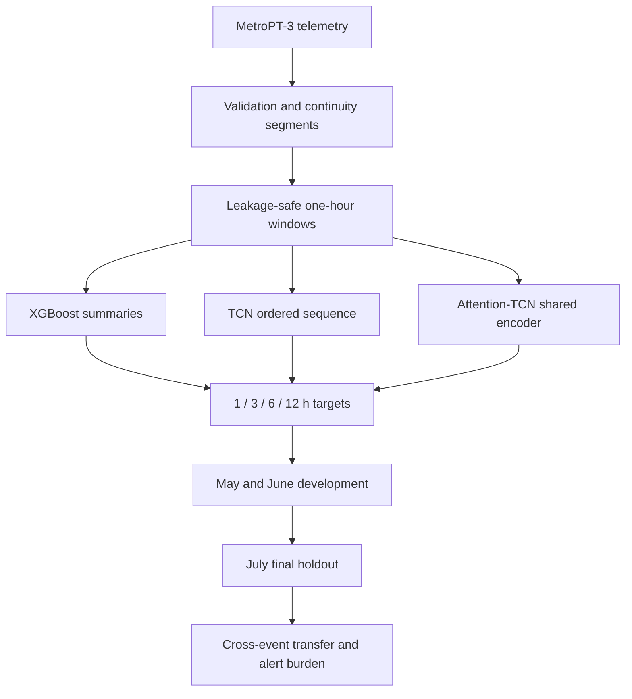

# MetroPT-3 temporal representation study

This project asks a narrow predictive-maintenance question: **does preserving richer
temporal structure improve transfer to a later, unseen compressor failure?**

It compares three predeclared representation levels on the MetroPT-3 air-compressor
telemetry:

1. **XGBoost** on engineered one-hour summary features;
2. **TCN** on 120 ordered 30-second steps from the same hour;
3. **Attention-TCN** with the same causal encoder plus attention pooling.

The answer was not the expected model-complexity progression. TCN ranked the May
precursor strongly and Attention-TCN ranked June strongly, but neither behavior
transferred to the held-out July failure. XGBoost generalized least poorly. That
cross-event reversal—not a production-readiness claim—is the central result.

## Project snapshot

- **1,516,948** raw telemetry rows; **1,515,830** rows passed validation.
- **334** continuity segments after gaps and invalid rows were separated.
- **8,012** complete one-hour feature windows.
- **7,846** predictive windows after excluding 166 windows that overlap active failures.
- **1 / 3 / 6 / 12-hour** prediction targets.
- May and June chronological development episodes; July final holdout.
- **3 seeds** for every model/horizon cell: 36 trained cells in total.
- Training-only preprocessing, raw-timestamp purging and development-only threshold selection.
- Committed per-window probabilities, metrics, thresholds, histories and manifests.

## Investigation flow



Observations are never allowed to cross continuity gaps. Feature extraction uses
half-open windows, and training windows touching a later evaluation interval are
explicitly purged. Active-failure observations are quarantined rather than mislabeled
as ordinary operation.

The sequence models receive 120 steps × 9 channels: eight sensor/actuator channels
plus an observation-coverage channel. Normalization and missing-value fallbacks are
fitted only on each training partition.

## Main result


At the one-hour horizon, mean AP lift over prevalence changes sharply by episode:

| Event | XGBoost | TCN | Attention-TCN |
|---|---:|---:|---:|
| May development | 1.00× | **14.99×** | 2.18× |
| June development | 1.64× | 2.57× | **13.60×** |
| July holdout | **1.63×** | 0.75× | 0.78× |

These are many overlapping windows but only three evaluated failure episodes. The
seed repetitions measure optimization sensitivity; they do not create additional
independent failures.

Across all four July horizons, XGBoost ranks best. Its advantage remains weak: mean
ROC-AUC stays below 0.5, and only its one-hour AP rises materially above prevalence.
The sequence models assign most July pre-failure windows lower scores than ordinary
windows.


Full metric tables and interpretation are in [RESULTS.md](RESULTS.md). The deeper
postmortem is in [WHAT_FAILED.md](WHAT_FAILED.md).

## Thresholds change alerts, not ranking

The fixed `0.5` threshold detects no July event in any of the 36 model/horizon/seed
cells. Operational thresholds were selected only from pooled May/June development
predictions using F2, with fewer false-alert episodes and then the higher threshold as
tie-breakers.

Those thresholds recover the July event in some settings, but only by accepting low
precision and frequent false alerts. For example, XGBoost detects July in all seeds at
3, 6 and 12 hours while producing about **1.49 false-alert episodes per evaluated day**;
precision remains below 1.2%. Event detection is therefore reported together with
ranking, precision and alert burden.


## Explore the evidence

The Streamlit app is an experiment results explorer, not a simulated maintenance
product. It reads the committed evidence and lets a visitor change:

- model;
- prediction horizon;
- May, June or July episode;
- `0.5` reference or development-selected threshold.

Views cover held-out ranking, cross-event transfer, probability timelines, seed
variation, event detection, first-warning lead time and false-alert burden.

```bash
python -m venv .venv
source .venv/bin/activate
pip install -r requirements.txt
pip install -e .
streamlit run demo/app.py
```

See [demo/README.md](demo/README.md) for the evidence boundary.

## Reproduce or audit

Generate the committed figures from the evidence tables:

```bash
pip install -r requirements-experiment.txt
pip install -e .
python scripts/generate_evidence_plots.py
```

Recompute the May/June/July ranking tables from prediction traces:

```bash
python scripts/analyze_temporal_results.py
```

The full experiment is frozen in [configs/temporal_experiment.json](configs/temporal_experiment.json)
and can be run with [notebooks/02_temporal_experiment_colab.ipynb](notebooks/02_temporal_experiment_colab.ipynb).
The complete protocol and decision boundaries are in
[EXPERIMENT_PROTOCOL.md](EXPERIMENT_PROTOCOL.md).

Committed evidence is sufficient to audit and recompute every reported metric. Exact
prediction recreation requires retraining from the frozen configuration because the
model binaries were not included in the returned export.

## What this project demonstrates

- Correct handling of cadence, continuity gaps and active-failure intervals.
- Explicit protection against overlapping-window temporal leakage.
- Controlled comparison of summary features and ordered sequence representations.
- Rare-event evaluation with AP interpreted relative to prevalence.
- Development-only early stopping and operational threshold selection.
- Alert-level metrics: false-alert episodes, event detection and warning lead time.
- Reproducible negative-result analysis and a clear holdout interpretation boundary.

July was untouched for the frozen three-model study. Its results have now been
inspected, so any future design motivated by July must be labeled exploratory rather
than described as another unseen test.

## Repository map

```text
configs/temporal_experiment.json     frozen study configuration
evidence/temporal_experiment/       metrics and per-window prediction traces
figures/                             plots generated from committed evidence
src/metropt3/                        validation, windows, sequences, models and analysis
notebooks/                           data audit and reproducible Colab experiment
demo/app.py                          interactive experiment results explorer
RESULTS.md                           technical result summary
WHAT_FAILED.md                       deeper failure analysis
INVESTIGATION_LOG.md                 compact decision history
```

Dataset: MetroPT-3, a public air-compressor telemetry dataset. The download script is
provided in `scripts/download_data.py`; the raw 218 MB CSV is intentionally not stored
in Git.
