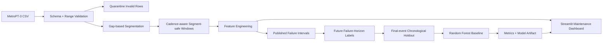

# MetroPT-3 Predictive Maintenance

[](https://github.com/SahilBh01r1769/metropt3-predictive-maintenance/actions/workflows/tests.yml)

A reproducible predictive-maintenance project built around the **MetroPT-3** air-compressor telemetry dataset. The repository turns raw multivariate time-series data into validated, segment-safe feature windows, labels those windows against the published failure intervals, trains a failure-horizon classifier, evaluates it with a chronological final-event holdout when possible, and exposes an interactive Streamlit maintenance dashboard.

> **Portfolio integrity:** this repository does not claim unverified historical RMSE/MAE or accuracy numbers. Metrics are generated by the reproducible training pipeline and written to `artifacts/metrics.json` after training on the real dataset.

## What this project does

- Validates required MetroPT sensor columns and quarantines malformed/out-of-range rows.
- Detects material timestamp gaps and assigns `segment_id` so feature windows never bridge discontinuities.
- Derives each segment's observed median sampling cadence instead of assuming one row per second.
- Builds configurable time windows (default **1 hour**, stepped every **30 minutes**) with cadence-aware coverage checks.
- Extracts summary statistics, rates of change, compressor duty cycle, pressure differential, and motor-current volatility.
- Converts the dataset's published failure reports into a **future failure-within-horizon** target (default **12 hours**).
- Excludes windows that are already inside an active failure from the predictive target.
- Prefers a **final-failure-episode chronological holdout** to reduce temporal leakage while retaining meaningful positive test examples.
- Trains a class-balanced Random Forest baseline and records balanced accuracy, precision, recall, F1, ROC-AUC and average precision when defined.
- Serves a Streamlit dashboard for sensor exploration, data-quality diagnostics and maintenance-risk visualization.

## Architecture



## Dataset

MetroPT-3 contains multivariate telemetry collected from an Air Production Unit (APU) in an operational metro train. The source includes pressure, temperature, motor-current and digital-control signals. Rather than relying on a fixed sampling-rate assumption, this project measures timestamp cadence directly from each continuous segment before deciding whether a feature window has sufficient coverage.

- UCI dataset: **MetroPT-3**, dataset ID 791
- UCI DOI: `10.24432/C5VW3R`
- License: **CC BY 4.0**
- Scientific Data article: *The MetroPT dataset for predictive maintenance* (Veloso et al., 2022)

The raw CSV is intentionally **not committed**.

## Reproducible dataset download

From the repository root:

```bash
python scripts/download_data.py
```

The downloader retrieves the official UCI archive and extracts:

```text
data/MetroPT3(AirCompressor).csv
```

You can also place that UCI CSV there manually. See [`data/README.md`](data/README.md) for details.

## Failure-label definition

The UCI documentation publishes four failure periods, all related to air-leak events. They are encoded in `src/metropt3/config.py`.

For each feature window ending at time `t`, the default target is:

```text
failure_within_horizon = 1
```

when the **next failure starts after `t` and within the next 12 hours**. Windows whose end time is already inside an active failure are marked `in_failure=True` and excluded from model training/evaluation.

This is a predictive classification target, not a claim that the repository has reconstructed a ground-truth continuous RUL label.

## Feature engineering

For each analogue sensor (`TP2`, `TP3`, `H1`, `DV_pressure`, `Reservoirs`, `Oil_temperature`, `Motor_current`), each window includes:

- mean
- standard deviation
- minimum
- maximum
- average rate of change

Additional features:

- `pressure_diff_mean` (`TP3 - TP2`)
- `comp_duty_cycle`
- `motor_current_volatility`

Observed `cadence_seconds` is retained as diagnostic metadata but is deliberately excluded from model features so the classifier cannot learn a sampling-pattern shortcut.

## Why segmentation and cadence matter

MetroPT is a long operational time series containing gaps and maintenance periods. Treating the entire file as one continuous stream can create feature windows that combine unrelated points across a gap, while assuming exactly one row per second can incorrectly reject valid windows from a more sparsely sampled segment.

`validate_and_segment()` starts a new segment when the timestamp gap exceeds the configured threshold (default: **30 seconds**). `build_windows()` then:

1. works within one `segment_id` at a time,
2. derives that segment's median positive timestamp difference,
3. estimates expected rows for the requested window duration, and
4. applies the coverage threshold against that cadence-aware expectation.

No feature window can cross a segment boundary.

## Evaluation strategy

A naive random split would leak future operating regimes into training. A naive last-20%-of-time split can also be misleading here because the final published failure may occur before the end of the dataset, leaving no positive examples in the test tail.

The baseline therefore prefers a **final-event holdout**: when viable, the test period begins several days before the final positive pre-failure window. This keeps the final failure episode unseen during training while retaining both positive and negative test examples. A standard chronological tail split is used only as a fallback.

## Quick start

### 1. Clone

```bash
git clone https://github.com/SahilBh01r1769/metropt3-predictive-maintenance.git
cd metropt3-predictive-maintenance
```

### 2. Create a Python 3.11 environment

```bash
python -m venv venv
```

Windows PowerShell:

```powershell
venv\Scripts\Activate.ps1
```

Linux/macOS:

```bash
source venv/bin/activate
```

### 3. Install

```bash
python -m pip install --upgrade pip
pip install -r requirements.txt
pip install -e .
```

### 4. Download the dataset

```bash
python scripts/download_data.py
```

### 5. Train and evaluate

```bash
python -m metropt3.cli train
```

Or provide another compatible CSV path:

```bash
python -m metropt3.cli train --csv path/to/MetroPT3.csv
```

Generated outputs:

```text
artifacts/
├── model.joblib
├── metrics.json
├── run_summary.json
├── window_features.csv
└── quarantine.csv        # only when invalid rows exist
```

## Dashboard demo

Run:

```bash
streamlit run demo/app.py
```

The dashboard supports:

1. **Healthy reference** — synthetic sensor telemetry for UI demonstration.
2. **Degradation scenario** — synthetic drifting telemetry for UI demonstration.
3. **Upload MetroPT-style CSV** — validate and visualize your own compatible data.

The built-in scenarios are explicitly synthetic. If `artifacts/model.joblib` exists, the dashboard shows the trained classifier's failure-risk probability for the latest compatible feature window. If no trained model artifact exists, it shows a clearly labeled **heuristic demo health-risk indicator**, not an ML prediction.

That distinction keeps the user-facing demo useful without presenting fabricated model performance.

## Tests

Install development requirements:

```bash
pip install -r requirements-dev.txt
pip install -e .
```

Run:

```bash
python -m pytest -q
```

The test suite covers:

- schema/range validation
- quarantine behavior
- timestamp-gap segmentation
- sparse-cadence window coverage
- segment-safe feature windows
- failure-horizon labels
- final-event/chronological splitting
- model-training smoke behavior

GitHub Actions also compiles the project and starts the Streamlit dashboard on a clean Python 3.11 runner.

## Repository structure

```text
.
├── .github/workflows/tests.yml
├── .streamlit/config.toml
├── artifacts/
├── data/
│   └── README.md
├── demo/
│   └── app.py
├── scripts/
│   └── download_data.py
├── src/metropt3/
│   ├── config.py
│   ├── validation.py
│   ├── features.py
│   ├── labels.py
│   ├── modeling.py
│   ├── pipeline.py
│   └── cli.py
├── tests/
├── pyproject.toml
├── requirements.txt
└── requirements-dev.txt
```

## Limitations

- MetroPT failure reports provide intervals rather than a dense supervised target for every timestamp.
- The default classifier is a reproducible baseline, not evidence that Random Forest is optimal for MetroPT.
- A 12-hour horizon and 7-day final-event context are modeling choices and should be evaluated against operational maintenance requirements.
- Class imbalance can be severe depending on horizon and time range; precision/recall and PR-AUC matter more than headline accuracy.
- A final-event chronological holdout reduces leakage risk but does not replace rolling-origin/backtesting studies across multiple failure episodes.
- Validation bounds are broad sanity checks, not learned anomaly thresholds.
- Synthetic demo scenarios are for visualization only and must not be used to report model quality.

## Future work

- Rolling-origin / walk-forward evaluation across failure episodes.
- Compare tree baselines with sequence models (LSTM/TCN/Transformer) using the exact same leakage-safe split policy.
- Probability calibration and maintenance-cost-aware threshold selection.
- Explainability with permutation importance or SHAP on trained artifacts.
- Optional hosted Streamlit demo branch after the baseline artifact strategy is fully verified.

## Attribution

Dataset creators and associated work should be cited when using MetroPT-3. See the UCI dataset page and the Scientific Data article for the authoritative citation details.

This repository's code implements the validation, segmentation, cadence-aware windowing, feature engineering, labeling, evaluation and visualization pipeline around the public dataset; it does not claim ownership of the MetroPT-3 data.
