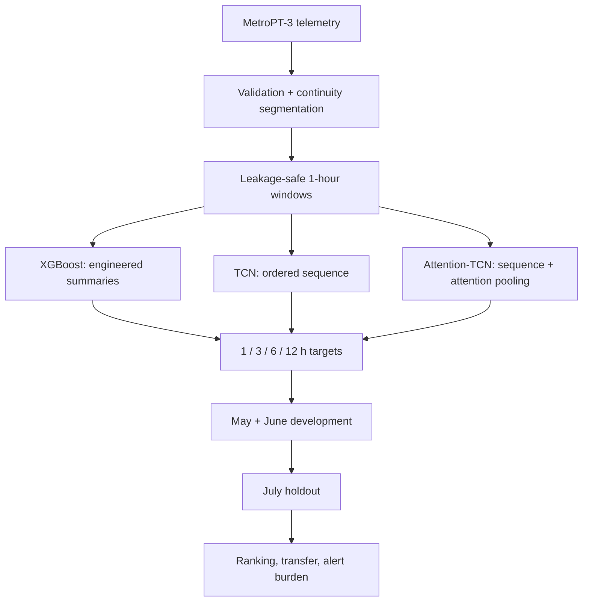

# MetroPT-3 Predictive Maintenance — Temporal Generalization Study

This project investigates a practical question in predictive maintenance: **does preserving richer temporal structure make failure-warning patterns transfer better to a later, unseen compressor failure?**

Using the MetroPT-3 air-compressor dataset, the study compares three representation levels under the same leakage-safe evaluation protocol:

1. **XGBoost** on engineered one-hour summary features
2. **TCN** on 120 ordered 30-second steps from the same hour
3. **Attention-TCN** using the same causal encoder with attention pooling

The result was not a simple “deeper model wins” progression. The temporal models learned strong patterns around different historical failures, but those patterns did not transfer reliably to the held-out July event. XGBoost was less impressive on the development episodes, yet generalized least poorly.

**[Open the interactive experiment explorer](https://metropt3-predictive-maintenance.streamlit.app/)**

## At a glance

| | |
|---|---|
| Dataset | **1,516,948** raw telemetry rows |
| Validated rows | **1,515,830** |
| Continuity segments | **334** |
| Complete 1-hour windows | **8,012** |
| Predictive windows | **7,846** after active-failure exclusion |
| Models | **XGBoost · TCN · Attention-TCN** |
| Prediction horizons | **1 / 3 / 6 / 12 hours** |
| Evaluation | May + June development, July final holdout |
| Repeated runs | **3 seeds** per model/horizon cell |

The pipeline uses training-only preprocessing, explicit raw-timestamp purging, continuity-aware windows, development-only threshold selection, and committed per-window prediction traces.

## The experiment



All three models observe the same one-hour history. The sequence path resamples that hour into 120 ordered 30-second steps across eight sensor/actuator channels plus an observation-coverage channel. Missing-value fallbacks and normalization are fitted only on the relevant training partition.

The final July episode is separated chronologically. Training windows that touch raw timestamps from the later evaluation interval are purged, so overlapping windows cannot leak the same observations across the split.

## Main result

At the one-hour horizon, the three representations behave very differently across failure episodes:

| Event | XGBoost AP lift | TCN AP lift | Attention-TCN AP lift |
|---|---:|---:|---:|
| May development | 1.00× | **14.99×** | 2.18× |
| June development | 1.64× | 2.57× | **13.60×** |
| July holdout | **1.63×** | 0.75× | 0.78× |


The interesting part is the reversal. TCN ranks the May precursor strongly, while Attention-TCN ranks June strongly. Neither ranking transfers to July. XGBoost is weaker on the development episodes but fails least severely on the later event.

Across the four July horizons, XGBoost ranks best of the three representations, although the absolute held-out performance remains weak. That makes the result useful as a **cross-event generalization study**, not as evidence of a deployable warning model.


## Why the transfer failed

A follow-up diagnostic compares engineered sensor features during the 24 hours before the May, June and July failures against clean normal-operation windows. Several feature directions repeat, but their magnitudes vary substantially; July often occupies a much stronger shifted regime.


For example, standardized precursor shifts for `TP2_mean`, `pressure_diff_mean` and `H1_mean` are much larger in July than in May or June. With only a few independent failure episodes, the evidence is consistent with **episode-specific precursor structure** rather than one stable warning signature.

The diagnostic is descriptive and does not change the frozen model results. Full tables are in [`evidence/event_regime`](evidence/event_regime).

## From scores to maintenance alerts

The project also tests what the probabilities would imply as an alert policy.

The default `0.5` threshold detects no July event. Thresholds selected only from May/June development data recover July in some model/horizon settings, but the added detection comes with very low precision and frequent false alerts. For example, XGBoost detects July in all seeds at the 3, 6 and 12-hour horizons while producing about **1.49 false-alert episodes per evaluated day**.

That trade-off is why the project reports ranking quality together with event detection, first-warning lead time and false-alert burden rather than presenting “failure detected” in isolation.


## Interactive evidence explorer

The Streamlit app is a compact experiment viewer backed by the committed evidence rather than a simulated production dashboard.

It lets a visitor change:

- model: XGBoost, TCN or Attention-TCN
- prediction horizon: 1, 3, 6 or 12 hours
- failure episode: May, June or July
- threshold policy: fixed `0.5` or development-selected

The views cover held-out ranking, cross-event transfer, probability timelines, seed variation, event detection, lead time and false-alert burden.

```bash
python -m venv .venv
source .venv/bin/activate
pip install -r requirements.txt
pip install -e .
streamlit run demo/app.py
```

See [`demo/README.md`](demo/README.md) for the evidence boundary.

## Reproduce and audit

Generate the committed figures from the evidence tables:

```bash
pip install -r requirements-experiment.txt
pip install -e .
python scripts/generate_evidence_plots.py
```

Recompute the May/June/July ranking tables from prediction traces:

```bash
python scripts/analyze_temporal_results.py
```

The full experiment configuration is frozen in [`configs/temporal_experiment.json`](configs/temporal_experiment.json) and can be rerun with [`notebooks/02_temporal_experiment_colab.ipynb`](notebooks/02_temporal_experiment_colab.ipynb).

The committed evidence contains metrics, thresholds, histories, manifests and per-window probability traces. Exact prediction recreation requires retraining because the model binaries were not included in the returned export.

## Engineering details

The project includes:

- cadence-aware validation and quarantine
- continuity segmentation across telemetry gaps
- active-failure exclusion before predictive labeling
- half-open one-hour feature windows
- raw-timestamp purging across the temporal split
- training-only normalization and missing-value handling
- causal TCN convolutions
- rare-event evaluation with AP interpreted against prevalence
- development-only early stopping and threshold selection
- alert-level metrics for detection, lead time and false-alert episodes
- committed experiment traces and reproducible evidence plots

The full protocol is in [`EXPERIMENT_PROTOCOL.md`](EXPERIMENT_PROTOCOL.md), the detailed results are in [`RESULTS.md`](RESULTS.md), and the deeper cross-event interpretation is in [`GENERALIZATION_ANALYSIS.md`](GENERALIZATION_ANALYSIS.md).

## Repository map

```text
configs/temporal_experiment.json     frozen experiment configuration
evidence/temporal_experiment/       metrics and per-window prediction traces
evidence/event_regime/              precursor-regime diagnostics
figures/                             generated evidence plots
src/metropt3/                        validation, windows, sequences, models and analysis
notebooks/                           data audit, model experiment and diagnostics
demo/app.py                          interactive experiment explorer
RESULTS.md                           measured results
GENERALIZATION_ANALYSIS.md           cross-event generalization analysis
INVESTIGATION_LOG.md                 compact decision history
```

## Scope

This repository is a controlled case study on one compressor dataset with very few independent failure episodes. It is intended to show how the predictive-maintenance question was investigated, how leakage and rare-event evaluation were handled, and what the model comparison actually established—not to claim a production-ready maintenance system.

Dataset: **MetroPT-3**, a public air-compressor telemetry dataset. The download script is provided in `scripts/download_data.py`; the raw 218 MB CSV is intentionally not stored in Git.
