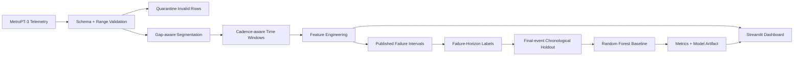

# MetroPT-3 Predictive Maintenance

[](https://github.com/SahilBh01r1769/metropt3-predictive-maintenance/actions/workflows/tests.yml)


> **From 1.5M+ rows of real metro air-compressor telemetry to a reproducible predictive-maintenance pipeline and interactive condition-monitoring dashboard.**

This project is an end-to-end predictive-maintenance case study built around the **MetroPT-3** dataset. It covers the complete workflow from raw industrial telemetry validation through gap-aware time-series segmentation, feature engineering, failure-horizon labeling, chronological evaluation, model artifact generation, and user-facing visualization.

The goal is not simply to train a classifier. The repository is structured around the harder engineering problems that appear in real sensor systems: irregular cadence, missing intervals, data-quality failures, temporal leakage, severe class imbalance, reproducible experimentation, and communicating model risk honestly.

## Project highlights

| Area | Implementation |
|---|---|
| Scale | **1,516,948** raw telemetry rows processed in the verified full-data run |
| Data quality | Schema/range validation, quarantine output, duplicate checks and timestamp-gap detection |
| Time-series safety | Cadence-aware segmentation so feature windows never bridge discontinuities |
| Feature pipeline | **38** model features from seven analogue sensors plus compressor behavior |
| Prediction target | Configurable future failure-within-horizon classification using published air-leak periods |
| Evaluation | Final-event chronological holdout designed to reduce temporal leakage |
| Reproducibility | UCI downloader, CLI training pipeline, persisted model/metrics/run artifacts |
| Visualization | Streamlit maintenance dashboard with condition trends, diagnostics and CSV upload |
| Engineering quality | Python 3.11 package structure, automated tests and GitHub Actions CI |

## System architecture



## Why this pipeline is different from a notebook-only ML project

A straightforward random train/test split on MetroPT-3 can produce misleading results because neighboring windows from the same operating period may appear in both sets. Likewise, assuming a fixed one-row-per-second cadence can silently corrupt window coverage when the actual timestamps behave differently.

This repository therefore treats preprocessing and evaluation as first-class parts of the model:

- feature windows are built **inside individual continuity segments**;
- segment cadence is inferred from observed timestamps rather than assumed;
- active-failure windows are separated from the pre-failure prediction target;
- sampling cadence is retained for diagnostics but excluded from model inputs;
- evaluation prefers a held-out final failure episode rather than a random split;
- every reported metric is generated by the reproducible training pipeline.

## Verified full-data run

A clean GitHub Actions run downloaded the official UCI archive and executed the complete pipeline end to end.

| Verified quantity | Result |
|---|---:|
| Raw rows | **1,516,948** |
| Valid rows | **1,515,830** |
| Quarantined rows | **1,118** |
| Duplicate timestamps | **0** |
| Continuity segments | **334** |
| Observed accepted-window cadence | **10 s / 12 s** |
| Segment-safe feature windows | **8,012** |
| Model features | **38** |
| Training windows | **5,818** |
| Test windows | **2,034** |
| Positive train/test windows | **72 / 24** |

The same verification run generated the trained model artifact, validated the metrics and run-summary artifacts, and successfully launched the Streamlit dashboard with the model artifact present.

## Baseline model status

The current Random Forest is deliberately treated as a **research baseline**, not as a production-ready predictor.

| Metric | Verified value |
|---|---:|
| Balanced accuracy | 0.5000 |
| ROC-AUC | 0.4862 |
| Average precision | 0.0111 |
| Precision | 0.0000 |
| Recall | 0.0000 |
| F1 | 0.0000 |

The held-out result shows that the current one-hour statistical feature set and 12-hour prediction horizon do not generalize well to the final failure episode. That result is useful: it prevents an easy random split from creating an inflated impression of model quality and provides a clean benchmark for stronger temporal features, alternate horizons and event-wise backtesting.

Full details are in [`RESULTS.md`](RESULTS.md).

## Dataset

**MetroPT-3** contains multivariate telemetry from an Air Production Unit (APU) operating in a metro train. The signals include pressure, temperature, motor current and digital control states associated with compressor behavior.

- UCI dataset: **MetroPT-3**, dataset ID 791
- DOI: `10.24432/C5VW3R`
- License: **CC BY 4.0**
- Associated publication: *The MetroPT dataset for predictive maintenance* — Veloso et al. (2022)

The large raw CSV is intentionally excluded from version control.

### Download the official dataset

```bash
python scripts/download_data.py
```

The script retrieves the official UCI archive and extracts:

```text
data/MetroPT3(AirCompressor).csv
```

See [`data/README.md`](data/README.md) for dataset and attribution notes.

## Validation and segmentation

The validation layer checks the required timestamp, analogue and digital columns and quarantines invalid rows instead of silently discarding them.

The real dataset also demonstrated why cadence needs to be derived from timestamps. Accepted feature windows in the verified run used median segment cadences of **10 and 12 seconds**, so the pipeline does not assume a universal 1 Hz row rate.

`validate_and_segment()` creates a new segment when the timestamp gap exceeds the configured threshold (default **30 seconds**). `build_windows()` then computes coverage using the segment's observed median cadence.

**Result:** a feature window can never combine samples from opposite sides of a material data gap.

## Feature engineering

For each analogue sensor:

- mean
- standard deviation
- minimum
- maximum
- rate of change

Sensors used:

- `TP2`
- `TP3`
- `H1`
- `DV_pressure`
- `Reservoirs`
- `Oil_temperature`
- `Motor_current`

Additional condition features include:

- mean pressure differential (`TP3 - TP2`)
- compressor duty cycle
- motor-current volatility

Default windowing:

```text
window length : 60 minutes
step          : 30 minutes
failure horizon: 12 hours
```

## Failure target

For a feature window ending at time `t`:

```text
failure_within_horizon = 1
```

when the next documented failure begins after `t` and within the configured prediction horizon.

Windows already inside a documented failure interval are marked separately and excluded from pre-failure training/evaluation.

This repository models **future failure risk classification**. It does not claim that MetroPT-3 provides a continuous ground-truth Remaining Useful Life target.

## Evaluation strategy

Random splitting is avoided because it can leak future operating regimes and highly similar neighboring windows into training.

The default evaluation therefore prefers a **final-event holdout**. When viable, the test period begins before the final pre-failure episode so that the final documented event remains unseen during training while the test data still contains both classes.

A chronological tail split is retained as a fallback for compatible datasets where an event-aware holdout cannot be formed.

## Interactive maintenance dashboard

Run the dashboard with:

```bash
streamlit run demo/app.py
```

The interface provides:

- sensor telemetry trends;
- continuous-segment visualization;
- validation and quarantine statistics;
- latest engineered-window summaries;
- oil-temperature, current and pressure condition indicators;
- window-level condition trends;
- sensor range diagnostics;
- compatible MetroPT-style CSV upload;
- optional trained-model probability when `artifacts/model.joblib` is present.

For a hosted demo without a bundled model artifact, the interface uses clearly labeled synthetic reference scenarios and a **heuristic demonstration health indicator**. These are for product/UI visualization and are not reported as validation results.

See [`demo/README.md`](demo/README.md) for deployment notes.

## Quick start

```bash
git clone https://github.com/SahilBh01r1769/metropt3-predictive-maintenance.git
cd metropt3-predictive-maintenance
python -m venv venv
```

Activate the environment, then install:

```bash
python -m pip install --upgrade pip
pip install -r requirements.txt
pip install -e .
```

Download MetroPT-3:

```bash
python scripts/download_data.py
```

Run the complete training pipeline:

```bash
python -m metropt3.cli train
```

Use another compatible file with:

```bash
python -m metropt3.cli train --csv path/to/MetroPT3.csv
```

Generated outputs:

```text
artifacts/
├── model.joblib
├── metrics.json
├── run_summary.json
├── window_features.csv
└── quarantine.csv
```

## Tests and CI

```bash
pip install -r requirements-dev.txt
pip install -e .
python -m pytest -q
```

Automated coverage includes:

- schema and range validation;
- quarantine behavior;
- timestamp-gap segmentation;
- sparse-cadence window coverage;
- segment-safe feature generation;
- failure-horizon labels;
- chronological/final-event splitting;
- model training smoke behavior;
- Streamlit startup on a clean Python 3.11 runner.

The repository was additionally verified with a disposable workflow that downloaded the complete UCI dataset, executed training, checked generated artifacts and started the dashboard with a real trained model artifact.

## Repository structure

```text
.
├── .github/workflows/tests.yml
├── .streamlit/config.toml
├── RESULTS.md
├── artifacts/
├── data/
│   └── README.md
├── demo/
│   ├── app.py
│   └── README.md
├── scripts/
│   └── download_data.py
├── src/metropt3/
│   ├── config.py
│   ├── validation.py
│   ├── features.py
│   ├── labels.py
│   ├── modeling.py
│   ├── pipeline.py
│   └── cli.py
├── tests/
├── pyproject.toml
├── requirements.txt
└── requirements-dev.txt
```

## Next modeling experiments

The current baseline creates a reproducible benchmark for the next stage:

- rolling-origin evaluation across individual failure episodes;
- 6 h / 24 h / 48 h failure horizons;
- lag, slope and longer-term degradation features;
- gradient-boosting baselines and probability calibration;
- maintenance-cost-aware alert thresholds;
- event-level recall and false-alarm analysis;
- LSTM, TCN or Transformer sequence models evaluated under the same leakage-safe policy.

## Scope and limitations

- Published failure reports are intervals, not dense per-timestamp labels.
- The default 12-hour target is highly imbalanced.
- Current validation ranges are broad sanity checks, not learned anomaly limits.
- The current Random Forest should be viewed as an engineering/research baseline.
- Synthetic dashboard scenarios demonstrate interaction and visualization only.

## Attribution

MetroPT-3 belongs to its dataset creators and is distributed by UCI under **CC BY 4.0**. This repository implements the validation, segmentation, cadence-aware windowing, feature engineering, labeling, evaluation and visualization pipeline around that public dataset; it does not claim ownership of the underlying data.
