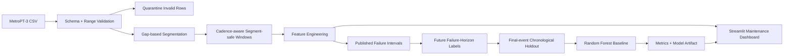

# MetroPT-3 Predictive Maintenance

[](https://github.com/SahilBh01r1769/metropt3-predictive-maintenance/actions/workflows/tests.yml)

A reproducible predictive-maintenance project built around the **MetroPT-3** air-compressor telemetry dataset. It validates and segments raw telemetry, builds cadence-aware time windows, engineers condition features, labels windows against published failure periods, evaluates a baseline chronologically, and exposes a Streamlit maintenance dashboard.

> **Portfolio integrity:** this repository does not carry forward unverified historical RMSE/MAE, LSTM, or percentage-improvement claims. The current full-data baseline has been reproduced on a clean GitHub Actions runner and is documented in [`RESULTS.md`](RESULTS.md). Its predictive performance is weak; that result is reported rather than hidden.

## What the project does

- Validates required MetroPT sensor columns and quarantines malformed/out-of-range rows.
- Detects material timestamp gaps and assigns `segment_id` so windows never bridge discontinuities.
- Derives each segment's observed median timestamp cadence instead of assuming one row per second.
- Builds default **1-hour** windows stepped every **30 minutes**, with cadence-aware coverage checks.
- Extracts sensor mean/std/min/max/rate-of-change plus pressure differential, compressor duty cycle, and motor-current volatility.
- Converts the published air-leak periods into a configurable **future failure-within-horizon** target (default **12 hours**).
- Excludes windows already inside an active failure from the predictive target.
- Prefers a **final-event chronological holdout** to reduce temporal leakage while retaining positive test examples.
- Trains a class-balanced Random Forest baseline and persists model/metrics artifacts.
- Provides a Streamlit condition-monitoring dashboard with synthetic reference scenarios and compatible CSV upload.

## Architecture



## Verified full-data baseline

The official UCI archive was downloaded and processed end to end in GitHub Actions.

- Raw rows: **1,516,948**
- Valid rows: **1,515,830**
- Quarantined rows: **1,118**
- Gap-defined segments: **334**
- Accepted-window median cadences: **10 s and 12 s**
- Segment-safe feature windows: **8,012**
- Model features: **38**
- Train/test windows: **5,818 / 2,034**
- Positive train/test windows: **72 / 24**
- ROC-AUC: **0.4862**
- Average precision: **0.0111**
- Recall/F1 at the default threshold: **0 / 0**

This baseline is therefore **not a useful failure predictor yet**. See [`RESULTS.md`](RESULTS.md) for the full interpretation and next modeling experiments. The important verified result at this stage is that the complete data/feature/label/model/demo pipeline is reproducible and leakage-conscious, not that the first model is production-ready.

## Dataset

MetroPT-3 contains multivariate telemetry collected from an Air Production Unit (APU) in an operational metro train, including pressure, temperature, motor-current and digital-control signals.

- UCI dataset: **MetroPT-3**, dataset ID 791
- DOI: `10.24432/C5VW3R`
- License: **CC BY 4.0**
- Associated paper: *The MetroPT dataset for predictive maintenance* (Veloso et al., 2022)

The raw CSV is intentionally not committed.

### Download

```bash
python scripts/download_data.py
```

The script retrieves the official UCI archive and extracts:

```text
data/MetroPT3(AirCompressor).csv
```

See [`data/README.md`](data/README.md) for attribution and manual-download details.

## Target definition

For each feature window ending at time `t`:

```text
failure_within_horizon = 1
```

when the **next published failure starts after `t` and within the next 12 hours**. Windows whose end time is already inside a failure interval are marked `in_failure=True` and excluded from training/evaluation.

This is a failure-horizon classification problem. The repository does **not** claim to reconstruct continuous ground-truth Remaining Useful Life.

## Cadence-aware segmentation and windowing

The real UCI CSV exposed why a fixed 1 Hz assumption is unsafe here. The accepted windows in the verified run used observed segment cadences of 10 and 12 seconds.

`validate_and_segment()` starts a new segment when a timestamp gap exceeds the configured threshold (default **30 seconds**). `build_windows()` then derives each segment's median positive timestamp difference and computes expected window coverage from that cadence. No feature window crosses a segment boundary.

`cadence_seconds` is kept as diagnostic metadata but excluded from model features so the classifier cannot learn a sampling-pattern shortcut.

## Evaluation strategy

Random splitting is inappropriate for this time-series problem because it can leak future operating regimes into training. A plain tail split can also leave no positive examples after the final documented failure.

The baseline therefore prefers a **final-event holdout**: when viable, testing begins several days before the final positive pre-failure window, keeping the last failure episode unseen during training while retaining both classes. A normal chronological tail split is only a fallback.

## Quick start

```bash
git clone https://github.com/SahilBh01r1769/metropt3-predictive-maintenance.git
cd metropt3-predictive-maintenance
python -m venv venv
```

Activate the environment, then:

```bash
python -m pip install --upgrade pip
pip install -r requirements.txt
pip install -e .
python scripts/download_data.py
python -m metropt3.cli train
```

Generated outputs:

```text
artifacts/
├── model.joblib
├── metrics.json
├── run_summary.json
├── window_features.csv
└── quarantine.csv        # when invalid rows exist
```

Use another compatible CSV with:

```bash
python -m metropt3.cli train --csv path/to/MetroPT3.csv
```

## Dashboard demo

```bash
streamlit run demo/app.py
```

The dashboard provides:

- **Healthy reference** — synthetic telemetry for UI demonstration.
- **Degradation scenario** — synthetic drifting telemetry for UI demonstration.
- **Upload MetroPT-style CSV** — validation, segmentation, feature-window and sensor visualization for compatible data.

If `artifacts/model.joblib` exists, the dashboard can show its latest-window probability. Without a model artifact, it displays a clearly labeled **heuristic demo health-risk indicator**, not an ML prediction. Synthetic scenarios are never presented as model-validation evidence.

## Tests and CI

```bash
pip install -r requirements-dev.txt
pip install -e .
python -m pytest -q
```

Tests cover validation/quarantine, gap segmentation, sparse-cadence coverage, segment-safe windows, failure-horizon labels, chronological/final-event splitting and model-training behavior. GitHub Actions also compiles the package and starts Streamlit on a clean Python 3.11 runner.

A disposable full-data verification workflow was additionally used to validate the official UCI download, full training pipeline, generated artifacts and Streamlit startup with a real trained artifact.

## Repository structure

```text
.
├── .github/workflows/tests.yml
├── .streamlit/config.toml
├── RESULTS.md
├── artifacts/
├── data/README.md
├── demo/app.py
├── scripts/download_data.py
├── src/metropt3/
│   ├── config.py
│   ├── validation.py
│   ├── features.py
│   ├── labels.py
│   ├── modeling.py
│   ├── pipeline.py
│   └── cli.py
├── tests/
├── pyproject.toml
├── requirements.txt
└── requirements-dev.txt
```

## Limitations and next work

- The failure reports are intervals rather than dense labels for every timestamp.
- The current 12-hour target is highly imbalanced and the verified Random Forest baseline is non-discriminative on the final-event holdout.
- Validation bounds are broad sanity checks, not learned anomaly thresholds.
- The final-event holdout is stronger than a random split but does not replace rolling-origin evaluation across all failure episodes.
- Next work should compare prediction horizons, stronger temporal/lag features, calibrated boosting baselines, event-wise backtesting and only then sequence models such as LSTM/TCN/Transformers under the same leakage-safe policy.

## Attribution

The MetroPT-3 data belongs to its dataset creators and is distributed by UCI under CC BY 4.0. This repository implements the validation, segmentation, cadence-aware windowing, feature engineering, labeling, baseline evaluation and visualization code around the public dataset; it does not claim ownership of the data.
