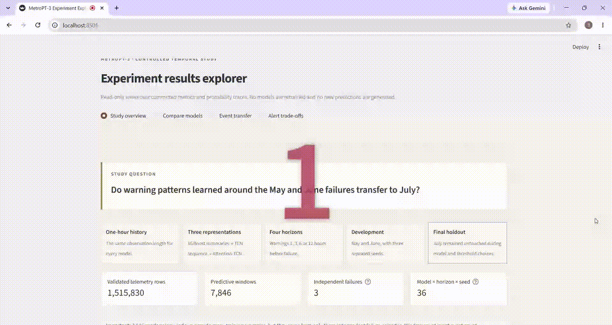
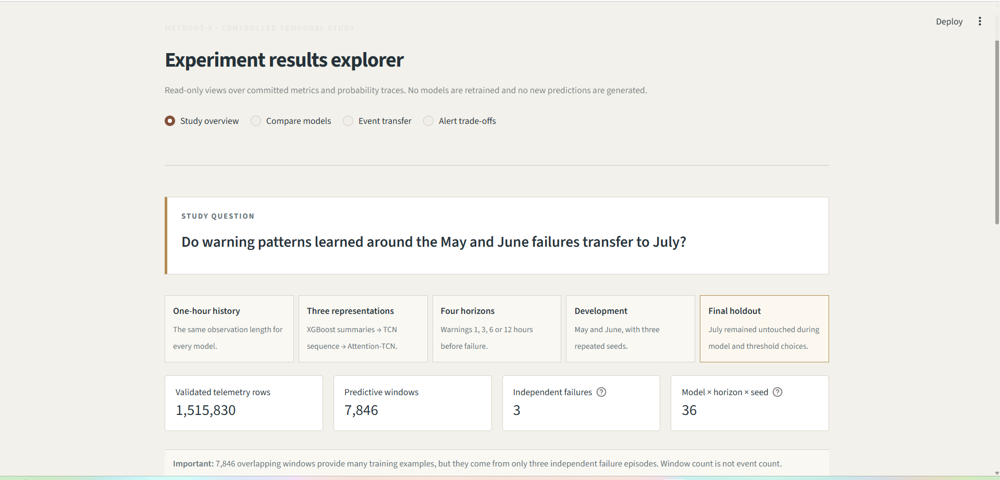
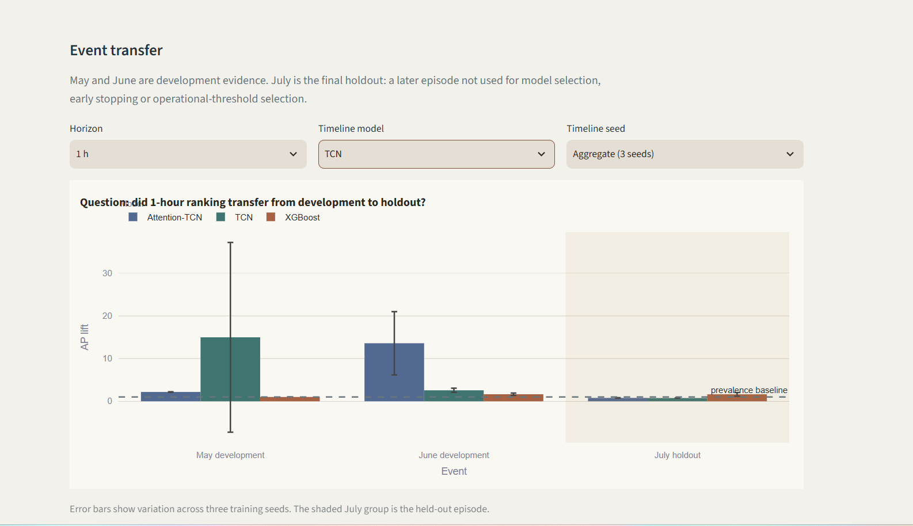
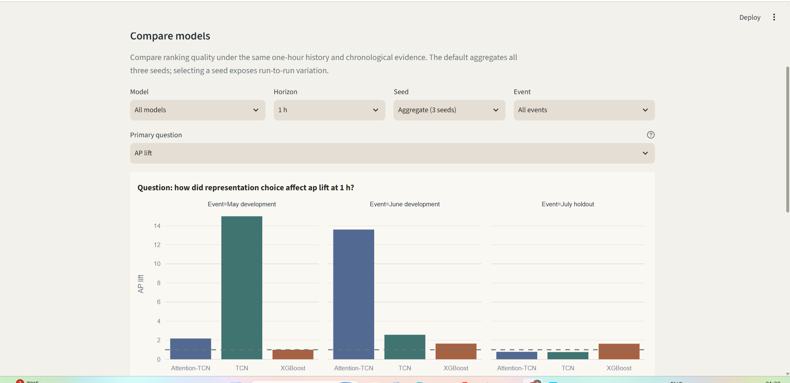
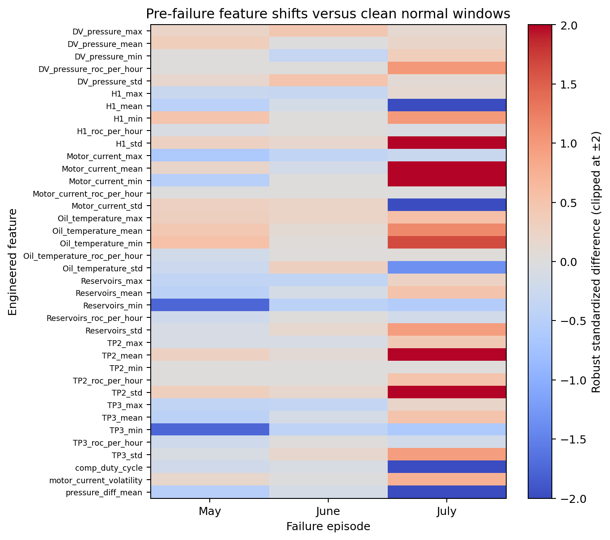

# MetroPT-3 Predictive Maintenance

Predictive-maintenance experiments on the MetroPT-3 air-compressor dataset, with a focus on whether warning patterns learned around earlier failures transfer to a later one.

## What I built

I built the data validation, gap-aware windowing, feature and sequence-model experiments, chronological evaluation, alert analysis, and Streamlit results explorer. The main aim was not to maximize one headline score, but to test whether results from a small number of failure episodes actually transfer to a later event.

The final comparison uses the same one-hour observation history for three models:

- **XGBoost** on engineered summary features
- **TCN** on the ordered sensor sequence
- **Attention-TCN** on the same TCN encoder with attention pooling

The models are evaluated at 1, 3, 6 and 12-hour warning horizons. May and June are used for development; July is kept as the final holdout for this experiment.

The main result is not a simple progression where the more complex model wins. TCN performs strongly around the May failure, Attention-TCN around June, but neither pattern transfers well to July. XGBoost is less impressive on the development episodes but holds up best on the later event.

## How the investigation changed

I originally expected the sequence models to improve as the architecture became more expressive. The development results appeared to support that idea, but the July holdout did not. This shifted the project from choosing a winning architecture to examining event-to-event transfer, false-alert burden, and how few independent failures are hidden behind thousands of overlapping windows.

**[Open the Streamlit results explorer](https://metropt3-predictive-maintenance.streamlit.app/)**

## Explorer preview

The explorer is intentionally read-only: it lets a visitor move through the frozen comparison and inspect the evidence without presenting a live maintenance product.



<details>
<summary>Static explorer snapshots</summary>

<p align="center">
  
  
</p>
<p align="center">
  
</p>

</details>

## Project snapshot

- **1,516,948** raw telemetry rows
- **334** continuity segments after validation and gap handling
- **8,012** complete one-hour windows
- **7,846** predictive windows after removing windows inside active failures
- **3 models × 4 prediction horizons × 3 seeds**
- committed per-window probabilities, thresholds and result tables

The raw dataset is not stored in the repository; `scripts/download_data.py` downloads the official MetroPT-3 archive.

## Model comparison

| Model | Input | Purpose |
|---|---|---|
| XGBoost | 38 engineered features from one hour | test whether summary statistics are already sufficient |
| TCN | 120 ordered 30-second steps | test whether preserving within-hour order helps |
| Attention-TCN | same sequence and TCN encoder | test whether attention pooling adds useful signal |

All three models use the same amount of history. The sequence models receive eight sensor/actuator channels plus one observation-coverage channel.

A random train/test split is avoided because the windows overlap heavily in time. The final setup keeps July later in time and purges training windows that touch the evaluation interval, preventing the same raw observations from appearing on both sides of the split.

## Main result

The one-hour horizon shows the event-to-event difference most clearly:

| Event | XGBoost AP lift | TCN AP lift | Attention-TCN AP lift |
|---|---:|---:|---:|
| May | 1.00× | **14.99×** | 2.18× |
| June | 1.64× | 2.57× | **13.60×** |
| July | **1.63×** | 0.75× | 0.78× |


The sequence models are capable of ranking different development failures strongly, but the learned pattern is not stable across events. Across all four July horizons, XGBoost ranks best of the three, although the held-out performance remains weak overall.

Detailed metrics and per-horizon results are in [RESULTS.md](RESULTS.md).


## Sensor-regime check

A follow-up diagnostic compares engineered features from the 24 hours before the May, June and July failures with clean normal-operation windows.



Several feature directions repeat, but the magnitude changes substantially between events. July is especially different for features such as `TP2_mean`, `pressure_diff_mean` and `H1_mean`.

This does not establish a universal failure signature. It does support the view that a large number of overlapping windows should not be treated as a large number of independent failure examples.

The underlying tables are in `evidence/event_regime/`.

## Alert thresholds

The model scores were also evaluated as maintenance alerts.

At the default `0.5` threshold, none of the models detects the July event. Thresholds selected only from May/June can recover July in some settings, but usually at the cost of frequent false alarms. For example, XGBoost detects July in all three seeds at 3, 6 and 12 hours with about **1.49 false-alert episodes per evaluated day**.

For that reason, event detection is reported together with precision, lead time and false-alert burden.


## Results explorer

The Streamlit app reads the saved experiment outputs rather than simulating a live maintenance product.

It allows comparison across:

- XGBoost, TCN and Attention-TCN
- 1, 3, 6 and 12-hour horizons
- May, June and July failure episodes
- the fixed `0.5` threshold and the threshold selected on development data

Run locally with:

```bash
python -m venv .venv
source .venv/bin/activate
pip install -r requirements.txt
pip install -e .
streamlit run demo/app.py
```

## Reproducing the experiment

The final experiment settings are in `configs/temporal_experiment.json`, and the Colab run is in `notebooks/02_temporal_experiment_colab.ipynb`.

To regenerate the result plots from the committed tables:

```bash
pip install -r requirements-experiment.txt
pip install -e .
python scripts/generate_evidence_plots.py
```

To recompute the event-wise ranking tables from the saved probability traces:

```bash
python scripts/analyze_temporal_results.py
```

The committed outputs are enough to audit the reported metrics. The model binaries were not part of the returned Colab export, so reproducing the exact predictions requires retraining from the saved configuration.

## Repository layout

```text
src/metropt3/                  preprocessing, sequence models and experiment code
configs/                       final experiment settings
evidence/                      saved metrics and probability traces
figures/                       plots built from those results
notebooks/                     data audit, training and follow-up diagnostics
demo/app.py                    Streamlit results explorer
RESULTS.md                     detailed numbers and interpretation
EXPERIMENT_PROTOCOL.md         setup used for the final run
```

## Scope

This is a case study on one compressor dataset with very few independent failure episodes. The results are useful for studying transfer between these events, but they should not be read as expected performance on another compressor or failure type.

July was untouched for the final three-model comparison. Any later redesign made specifically because of the July outcome should therefore be treated as follow-up analysis rather than another untouched test.

Dataset: **MetroPT-3** public air-compressor telemetry.