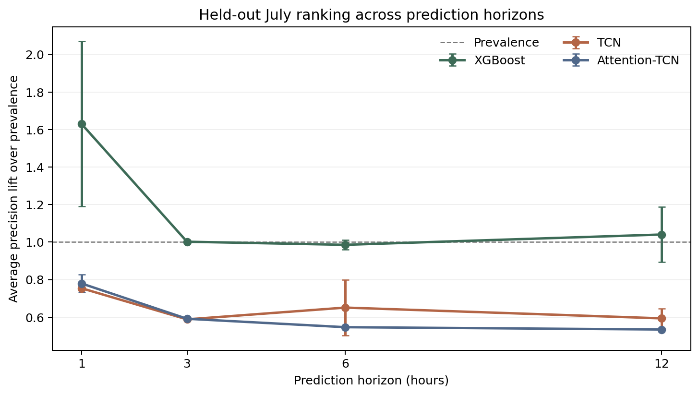
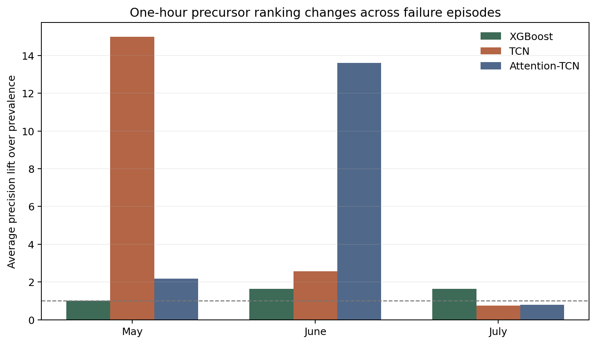
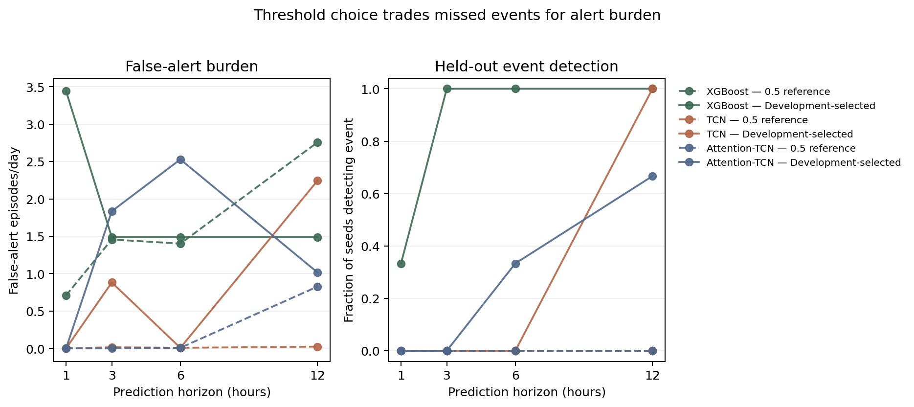
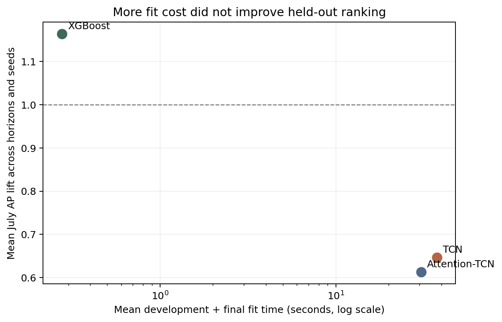
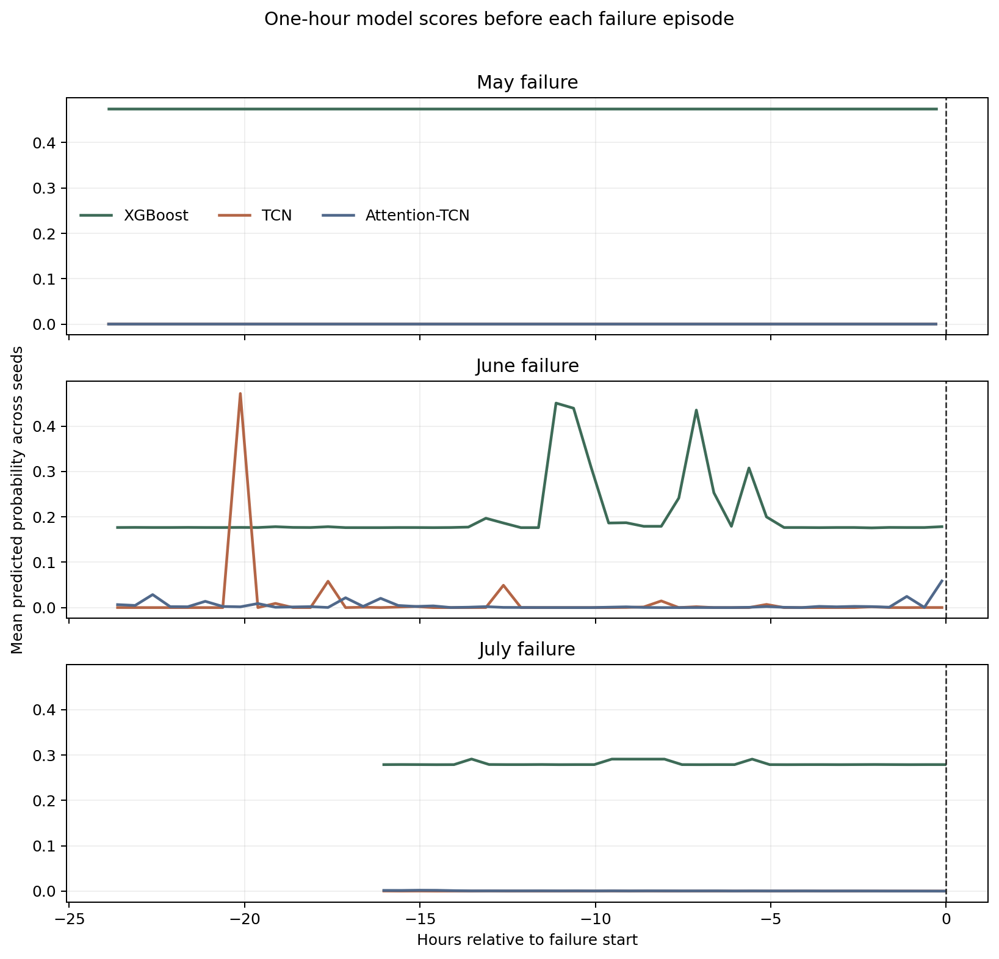

# Temporal representation experiment

The controlled comparison did not produce a useful failure predictor. It did produce
a clear result: on the final July episode, increasing representation complexity from
engineered summaries to ordered sequences and attention did not improve transfer.



## Experimental question

Can one hour of compressor history rank windows preceding an unseen air-leak episode
above ordinary operating windows, and does preserving within-hour order help?

Only the representation and model change:

1. **XGBoost** receives 38 engineered one-hour summary features.
2. **TCN** receives 120 ordered 30-second steps across nine channels.
3. **Attention-TCN** uses the same causal TCN encoder and adds attention pooling.

All models use the same 7,846 predictive windows, 1/3/6/12-hour targets, fixed July
holdout, three seeds and training-only preprocessing. Early stopping and operational
thresholds use two earlier chronological development folds. July is never used for
tuning.

## Primary result: probability ranking

Average precision (AP) is averaged over seeds 17, 42 and 89. Lift divides AP by the
positive prevalence for that horizon; `1.0×` is random-ranking performance.

| Model | Horizon | AP, mean ± SD | AP lift | ROC-AUC |
|---|---:|---:|---:|---:|
| XGBoost | 1 h | 0.001604 ± 0.000433 | **1.63×** | 0.420 |
| XGBoost | 3 h | 0.002958 ± 0.000006 | 1.00× | 0.438 |
| XGBoost | 6 h | 0.005819 ± 0.000150 | 0.99× | 0.438 |
| XGBoost | 12 h | 0.012286 ± 0.001744 | 1.04× | 0.456 |
| TCN | 1 h | 0.000742 ± 0.000001 | 0.75× | 0.005 |
| TCN | 3 h | 0.001736 ± 0.000013 | 0.59× | 0.012 |
| TCN | 6 h | 0.003843 ± 0.000876 | 0.65× | 0.155 |
| TCN | 12 h | 0.007008 ± 0.000616 | 0.59× | 0.180 |
| Attention-TCN | 1 h | 0.000767 ± 0.000047 | 0.78× | 0.040 |
| Attention-TCN | 3 h | 0.001745 ± 0.000020 | 0.59× | 0.016 |
| Attention-TCN | 6 h | 0.003226 ± 0.000011 | 0.55× | 0.008 |
| Attention-TCN | 12 h | 0.006306 ± 0.000044 | 0.53× | 0.025 |

XGBoost ranks best at every horizon, but only its one-hour result rises materially
above prevalence. Its ROC-AUC remains below 0.5 at every horizon. Both sequence models
rank the July positives below most negative windows; attention does not repair that
failure.

Absolute AP rises with the horizon because the number of positive windows rises from
2 at one hour to 24 at twelve hours. Lift is therefore the fairer cross-horizon view.
The experiment does not support a claim that the twelve-hour task is learned better.

## Event-to-event transfer

The July collapse is not evidence that the sequence models learned nothing. Replaying
the same threshold-free metrics separately for each failure shows that they learned
different development episodes. The one-hour results make the contrast clearest:

| Event | XGBoost AP lift | TCN AP lift | Attention-TCN AP lift |
|---|---:|---:|---:|
| May development failure | 1.00× | **14.99×** | 2.18× |
| June development failure | 1.64× | 2.57× | **13.60×** |
| July final holdout | **1.63×** | 0.75× | 0.78× |

These are means over the same three seeds, but the three rows are only three failure
episodes. TCN ranks the May precursor strongly; attention ranks the June precursor
strongly; neither behavior transfers to July. That reversal is the central modeling
result: added capacity fits episode-specific signals without establishing a shared
warning signature.

The event-wise tables are generated directly from the committed probability traces:

```bash
python scripts/analyze_temporal_results.py
```

They record AP, lift over prevalence, ROC-AUC and positive-versus-negative median score
separation for every event, model, horizon and seed.



## Alert policy result

The `0.5` reference threshold detects no held-out event for any model, horizon or seed.
The following table uses thresholds selected only from pooled development predictions.
“Detected” is the number of seeds with at least one true-positive July alert.

| Model | Horizon | Threshold | Detected | False-alert episodes/day | First-alert lead time |
|---|---:|---:|---:|---:|---:|
| XGBoost | 1 h | 0.30 | 1/3 | 3.44 | 0.53 h |
| XGBoost | 3 h | 0.38 | 3/3 | 1.49 | 2.53 h |
| XGBoost | 6 h | 0.36 | 3/3 | 1.49 | 5.53 h |
| XGBoost | 12 h | 0.35 | 3/3 | 1.49 | 11.53 h |
| TCN | 1 h | 0.95 | 0/3 | 0.00 | — |
| TCN | 3 h | 0.08 | 0/3 | 0.88 | — |
| TCN | 6 h | 0.87 | 0/3 | 0.01 | — |
| TCN | 12 h | 0.05 | 3/3 | 2.24 | 11.53 h |
| Attention-TCN | 1 h | 0.06 | 0/3 | 0.00 | — |
| Attention-TCN | 3 h | 0.05 | 0/3 | 1.83 | — |
| Attention-TCN | 6 h | 0.05 | 1/3 | 2.53 | 5.53 h |
| Attention-TCN | 12 h | 0.06 | 2/3 | 1.02 | 11.53 h |

These detections are not evidence of a deployable alert policy. At 3/6/12 hours,
XGBoost's mean recall is 1.0 but its precision is only 0.003/0.006/0.012 and balanced
accuracy is 0.5. The development threshold has become permissive enough to flag the
event while also flagging many ordinary periods. TCN's twelve-hour detection has the
same problem: mean precision is 0.0085 with 2.24 false-alert episodes per evaluated
day.



## Cost of representation complexity

Measurements below are means across all horizons and seeds from the same Tesla T4
session. Timing is execution evidence, not a cross-machine benchmark.

| Model | Mean development fit | Mean final fit | Mean prediction | Stored artifact | Parameters |
|---|---:|---:|---:|---:|---:|
| XGBoost | 0.21 s | 0.06 s | 0.006 s | 17.6 KB | tree-dependent |
| TCN | 29.26 s | 8.31 s | 0.018 s | 126.9 KB | 29,185 |
| Attention-TCN | 25.13 s | 5.51 s | 0.018 s | 132.6 KB | 30,274 |

The sequence models cost roughly two orders of magnitude more fit time than XGBoost
without improving held-out ranking. Attention adds 1,089 parameters and also fails to
improve ranking over the shared TCN encoder.



## Event-centered scores

The probability traces show the ranking failure directly rather than reducing it to a
single score. Development models produce episode-specific score structure before May
and June, while the July precursor remains below or indistinguishable from ordinary
windows for the sequence models.



## What this experiment establishes

- The corrected pipeline runs end to end over the audited 1.5-million-row dataset.
- Raw training and holdout timestamps are explicitly disjoint.
- Per-window probabilities expose failures that summary scores previously hid.
- XGBoost is the strongest of the three representations, but its advantage is weak.
- More expressive temporal models do not compensate for very few independent failure
  episodes or a non-transferable representation.
- A threshold can create apparent event detection without useful ranking or acceptable
  alert precision.

This is evidence from one held-out failure episode. It is a case study of transfer to
July, not an estimate of performance across compressors or failure types.

The complete 72 metric rows and the exported prediction traces are in
[`evidence/temporal_experiment`](evidence/temporal_experiment/README.md).
